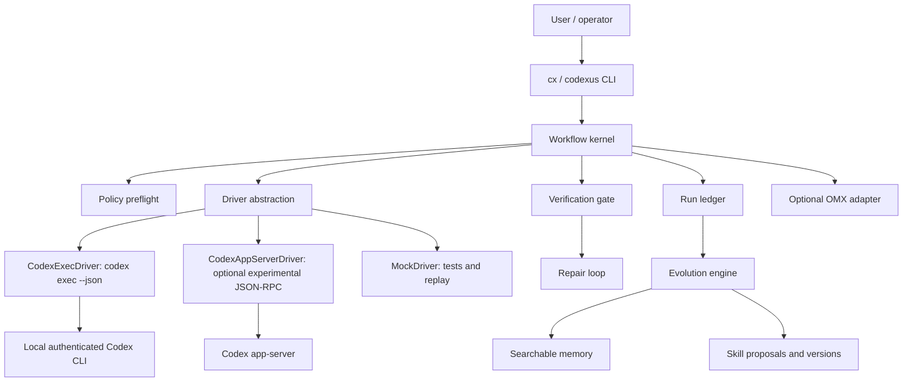

# Architecture

[한국어](../ko/design/01-architecture.md)

## Purpose

Codexus is a local evolutionary runtime harness for OpenAI Codex. It does not replace Codex. It supervises Codex runs, records durable state, verifies outcomes, extracts reusable experience, and gradually improves future runs through explicit memory and skill promotion.

The architecture is intentionally CLI-first for the MVP. The stable MVP driver is `codex exec --json`; experimental Codex app-server integration and a Codex-native adapter are later surfaces behind capability detection.

Canonical product and CLI names:

- product: `Codexus`
- target CLI: `cx`
- long-form alias: `codexus`
- temporary MVP alias: `chx`

## Reference Governance

Harness architecture is reference-first. Before changing core harness behavior,
consult the mandatory upstream references and record the mapping in
[Reference governance](../references/README.md).

Mandatory references:

- [ultraworkers/claw-code](https://github.com/ultraworkers/claw-code) for
  parity-first CLI and harness behavior.
- [NousResearch/hermes-agent](https://github.com/NousResearch/hermes-agent) for
  evolutionary memory, skills, cron, gateways, terminal backends, and isolated
  subagents.
- [Gitlawb/openclaude](https://github.com/Gitlawb/openclaude) for provider
  profiles, Codex auth reuse, tool loops, permissions, headless service
  boundaries, and descriptor-first integration architecture.

If Codexus intentionally diverges from a reference, the design note must record
the constraint, rejected upstream path, Codexus decision, and residual risk.

## System Boundary

In scope:

- local CLI orchestration
- Codex run supervision
- durable run ledger
- verification gates
- repair loops
- memory and skill proposal
- replay tests for proposed skills
- optional OMX interop

Out of scope for the first design:

- direct private ChatGPT/Codex backend calls
- replacing Codex tool execution internals
- replacing OMX
- uncontrolled autonomous mutation of user/project skill stores
- hosted multi-tenant service behavior

## Conceptual Model



## Runtime Surfaces

Codexus has two intended runtime surfaces.

External CLI runtime, implemented first:

```text
User -> cx/codexus -> Codexus core -> codex exec --json -> Codex
```

This mode is strongest for supervised runs, automation, verification gates, replay, repair, and durable evidence.

Codex-native adapter, planned next:

```text
Codex interactive session -> Codexus skill/plugin/command adapter -> Codexus core
```

This mode should make Codexus feel closer to OMX inside a running Codex session. It must call the same core runtime and share the same ledger/memory/skill store rather than duplicating orchestration logic.

## Major Components

### CLI

The CLI is the operator surface. It should expose every important operation in human-readable and machine-readable form.

Initial commands, shown with the target `cx` CLI:

- `cx doctor`
- `cx run`
- `cx status`
- `cx verify`
- `cx resume`
- `cx replay`
- `cx memory search`
- `cx skill propose`
- `cx skill review`
- `cx skill promote`
- `cx skill deprecate`
- `cx adapt omx status`

Every command that can be used by automation must support `--json`.

### Workflow Kernel

The kernel owns phase transitions and terminal outcomes. It does not trust a model's final prose as completion evidence. Completion requires:

1. driver result captured,
2. run ledger written,
3. verification policy evaluated,
4. terminal outcome stored.

Phases:

- `intake`
- `research`
- `plan`
- `execute`
- `verify`
- `repair`
- `evolve`
- `complete`
- `failed`
- `blocked`
- `cancelled`

Terminal outcomes:

- `complete`
- `failed`
- `blocked`
- `cancelled`

### Drivers

Drivers convert a harness request into a model/runtime execution.

Drivers are adapters around unstable external surfaces. They own capability detection, flag mapping, raw output capture, and error classification for their runtime. The workflow kernel only consumes the driver contract; it must not know command-line quirks for a particular Codex version.

`CodexExecDriver` is the MVP default:

- launches `codex exec --json`,
- passes cwd, sandbox, model, and prompt options when supported by the installed Codex CLI,
- captures stdout JSONL and stderr,
- preserves raw events,
- emits normalized harness events.

Driver options are capability-gated. The harness must not assume every Codex CLI subcommand accepts every top-level Codex flag; unsupported flags are omitted or mapped through a driver-specific mechanism.

Capability examples:

- `supportsSandboxFlag`
- `supportsApprovalFlag`
- `supportsModelFlag`
- `emitsJsonl`
- `emitsNestedFinalMessage`
- `stderrMayContainWarningsOnSuccess`

`CodexAppServerDriver` is experimental:

- uses generated Codex app-server protocol schemas,
- starts/resumes threads,
- starts turns,
- streams notifications,
- handles approval requests if supported,
- remains disabled unless capability checks pass.

`MockDriver` is required:

- deterministic outcomes,
- no network/model dependency,
- fixture-driven tests,
- replay validation for skills and workflow transitions.

### Subagent Policy

Subagents are optional acceleration, not a correctness dependency. ChatGPT-authenticated Codex accounts may not support every fixed role model used by native subagents. The harness should:

- prefer local deterministic workflow code for critical paths,
- use subagents only when explicitly requested or clearly useful,
- prefer inherited/default subagent models over hardcoded model names,
- treat subagent failure as a scheduling failure, not a harness runtime failure,
- record subagent limitations as capability evidence.

### Run Ledger

The run ledger is the source of truth for what happened. It is append-oriented and safe to inspect after process death.

Default root:

```text
.codex-harness/
  runs/
    <run-id>/
      input.json
      state.json
      events.jsonl
      raw/
        codex-stdout.jsonl
        codex-stderr.log
      artifacts/
      verification.json
      experience.json
      report.md
```

The ledger must be sufficient to reconstruct `cx status <run-id>` without a running process.

### Verification Gate

Verification is a first-class phase, not a final note. A run cannot be `complete` if required verification failed, was skipped without policy allowance, or produced unreadable output.

Verification sources:

- configured shell commands,
- test/lint/typecheck scripts,
- file existence checks,
- JSON schema checks,
- model-output constraints,
- replay scenarios for proposed skills.

### Evolution Engine

The evolution engine turns run evidence into future leverage. It should not silently change active behavior.

Outputs:

- experience records,
- memory entries,
- skill proposals,
- routing rule proposals,
- verification pattern proposals,
- stale/unsafe skill deprecation suggestions.

Promotion is explicit and versioned.

### Optional OMX Adapter

OMX is a sibling/reference harness layer. Interop should be useful but optional.

The adapter may:

- detect installed OMX version,
- call `omx explore` for narrow read-only exploration,
- call `omx sparkshell` for noisy read-only or verification commands,
- write adapter metadata under `.omx/adapters/codex-harness/`,
- export plan artifacts compatible with `.omx/plans/`.

The adapter must not:

- mutate `.omx/state` directly,
- assume upstream-only features exist locally,
- make OMX required for basic `cx run`.

## Data Flow

### Basic Run

1. User runs `cx run`.
2. CLI resolves config and creates a run id.
3. Policy preflight classifies risk.
4. Kernel writes `input.json` and initial `state.json`.
5. Driver starts Codex and streams events.
6. Event normalizer appends `events.jsonl`.
7. Kernel writes driver result.
8. Verification gate runs checks.
9. Kernel sets terminal outcome or enters repair.
10. Evolution engine writes experience records and may write proposals only through explicit commands or configured policy.
11. CLI prints a concise report.

### Verification Failure

1. Verification command fails.
2. Kernel writes failing evidence to `verification.json`.
3. If repair budget remains, kernel prompts Codex with bounded failure context.
4. Driver runs repair turn.
5. Verification runs again.
6. Terminal outcome depends on final verification.

### Skill Proposal

1. Evolution engine detects a reusable pattern.
2. It writes a proposed skill under `.codex-harness/skills/proposed/<skill-id>/`.
3. Replay tests are generated or linked.
4. `cx skill review` presents scope, trigger, procedure, evidence, and risk.
5. `cx skill promote` installs a versioned approved copy.

## Dependency Direction

Allowed dependencies:

- CLI depends on kernel.
- Kernel depends on drivers, ledger, policy, verification, evolution.
- Drivers depend on external processes/protocols.
- Evolution depends on ledger and memory/skill stores.
- OMX adapter depends on local OMX process detection and command execution.

Forbidden dependencies:

- Drivers must not depend on evolution logic.
- Memory retrieval must not bypass policy.
- Skill promotion must not directly mutate Codex/OMX stores without explicit command invocation.
- App-server driver must not become required for `cx run`.

## Reliability Strategy

- Preserve raw Codex JSONL before parsing assumptions.
- Normalize events tolerantly.
- Write state after each phase transition.
- Use atomic writes for `state.json`.
- Keep append-only logs for audit.
- Treat process death as recoverable if ledger exists.
- Keep mock driver parity tests close to real driver behavior.

## Security Posture

- Reuse Codex sandbox/approval flags.
- Add harness-side risk classification before driver execution.
- Redact obvious secrets before memory/skill proposal.
- Store raw run events locally but avoid injecting raw history into future prompts.
- Make promotion and deprecation auditable.

## Initial Technology Choice

Use TypeScript/Node for the first implementation because:

- local Node is already available,
- OMX is TypeScript/Node,
- process orchestration and JSONL handling are straightforward,
- package and CLI iteration cost is low.

This choice does not prevent a later Rust core if the runtime needs stronger single-binary distribution or lower overhead.
