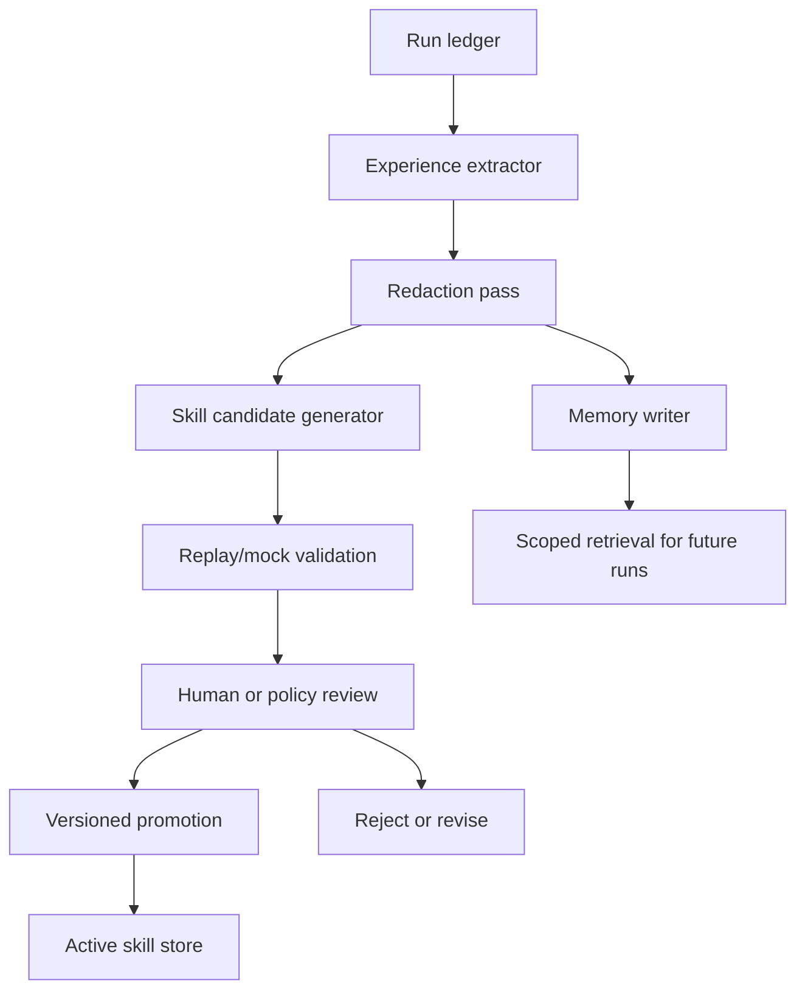

# Evolution Engine Design

[Korean](../ko/design/03-evolution-engine.md)

## Intent

The evolution engine makes Codexus improve from experience without silently rewriting its own behavior. It is inspired by Hermes Agent's learning loop, but the Codexus version is local, auditable, and promotion-gated.

The engine answers four questions after each meaningful run:

1. What happened?
2. What should be remembered?
3. What procedure could be reused?
4. What evidence proves that reusing it is safe?

## Reference Alignment

Hermes remains the primary reference for the learning loop, but the corrected
Claw audit changes the evidence standard for evolution. Memories and skills
should be derived from typed run facts, verification records, replay outcomes,
and structured event/report records. They should not be derived from terminal
prose alone when a structured event exists.

Claw's mock parity harness also defines the next replay direction: skill
proposals should eventually be tested against scenarios that cover tool
success, tool denial, permission prompt branches, multi-tool turns,
plugin/skill path behavior, compaction/large-output behavior, and usage
metadata.

## Non-Goals

- No silent prompt mutation.
- No automatic installation into Codex skill directories.
- No unbounded transcript injection into future prompts.
- No memory writes before redaction policy.
- No skill promotion without scope and replay evidence.

## Evolution Pipeline



## Experience Record

`experience.json` is written per run.

```json
{
  "schemaVersion": 1,
  "runId": "run_...",
  "createdAt": "2026-05-29T08:30:00.000Z",
  "task": {
    "summary": "Fix parser regression",
    "shape": "bugfix",
    "domains": ["typescript", "tests"]
  },
  "context": {
    "cwd": "/absolute/path",
    "gitRoot": "/absolute/path",
    "filesTouched": ["src/parser.ts", "test/parser.test.ts"]
  },
  "decisions": [
    {
      "summary": "Kept parser API stable",
      "reason": "Callers depend on current return shape",
      "evidence": ["events.jsonl#evt_123"]
    }
  ],
  "failures": [
    {
      "summary": "Initial verification failed on empty input",
      "lesson": "Parser tests must include empty input cases",
      "evidence": ["verification.json#verify_001"]
    }
  ],
  "verification": {
    "status": "passed",
    "commands": ["npm test"]
  },
  "reusableLessons": [
    {
      "kind": "verification_pattern",
      "summary": "For parser changes, include empty input and malformed token tests."
    }
  ]
}
```

Experience records are evidence-backed. If the extractor cannot cite an event, artifact, or verification record, it should mark the claim as low confidence.

## Memory Store

Memory is not raw transcript storage. Raw logs stay in run ledgers. Memory contains compact, redacted, source-linked facts and lessons.

Layout:

```text
.codexus/memory/
  entries.jsonl
  index.json
  summaries/
    project.md
    recurring-failures.md
```

Memory entry:

```json
{
  "schemaVersion": 1,
  "id": "mem_...",
  "createdAt": "2026-05-29T08:31:00.000Z",
  "sourceRunId": "run_...",
  "kind": "repo_fact",
  "scope": {
    "project": "/absolute/path",
    "paths": ["src/parser.ts"]
  },
  "text": "Parser changes require empty input and malformed token regression tests.",
  "tags": ["parser", "verification"],
  "confidence": "medium",
  "expiresAt": null,
  "supersedes": []
}
```

Kinds:

- `repo_fact`
- `user_preference`
- `workflow_lesson`
- `verification_pattern`
- `failure_pattern`
- `tooling_note`

Memory quality uses a lightweight curation profile, not standards compliance.
Codexus borrows requirement-quality characteristics such as
traceability, singularity, unambiguity, scope boundedness, verifiability, and
conflict review, but these are curator-derived tri-state findings
(`pass/fail/unknown`), not self-asserted memory fields. Conflict detection should
surface review candidates and possible supersession relationships without
auto-rewriting memory. See
[Memory quality curation plan](../plans/2026-05-30-memory-quality-curation-plan.md).

## Retrieval Rules

Retrieval must be scoped and bounded.

Inputs:

- task text,
- cwd/git root,
- mentioned files,
- selected tags,
- recency,
- explicit user request.

Output:

- top relevant memory entries,
- source run ids,
- confidence,
- reason for inclusion.

The prompt injection budget should start small: no more than 5 memory entries or 1200 words unless the user explicitly asks for deeper recall.

## Skill Candidate

Proposed skills live under:

```text
.codexus/skills/proposed/<skill-id>/
  skill.json
  SKILL.md
  evidence.json
  replay.json
  review.md
```

`skill.json`:

```json
{
  "schemaVersion": 1,
  "id": "skill_parser_regression_tests",
  "name": "parser-regression-tests",
  "displayName": "codexus:parser-regression-tests",
  "status": "proposed",
  "version": "0.1.0",
  "sourceRunIds": ["run_..."],
  "trigger": {
    "keywords": ["parser", "tokenizer", "grammar"],
    "pathGlobs": ["src/**/*parser*", "test/**/*parser*"]
  },
  "scope": {
    "allowedTaskShapes": ["bugfix", "refactor"],
    "excludedTaskShapes": ["security_fix"]
  },
  "procedure": [
    "Find parser entrypoints and existing tests.",
    "Add malformed input and empty input regression cases.",
    "Run parser-focused tests before broad test suites."
  ],
  "safety": {
    "requiresVerification": true,
    "forbiddenActions": ["change public AST shape without explicit plan"]
  },
  "promotion": {
    "requiredReplayStatus": "passed",
    "reviewedBy": null,
    "promotedAt": null
  }
}
```

Codexus keeps storage identity and Codex-facing identity separate. The storage id
remains stable and filesystem-safe, for example `skill_parser_regression_tests`.
The Codex-facing display identity is namespaced as `codexus:<skill-name>`, for
example `codexus:parser-regression-tests`. This makes generated Codexus skills
visibly distinct from user-authored Codex skills and plugin-provided skills while
preserving reversible local storage.

`SKILL.md` should be human-readable and compatible with future installation into a Codex skill surface when explicitly promoted.

## Replay Validation

Replay gives a proposed skill a deterministic proving ground.

Replay scenario:

```json
{
  "schemaVersion": 1,
  "skillId": "skill_parser_regression_tests",
  "scenarios": [
    {
      "id": "parser_bugfix_requires_edge_tests",
      "driver": "mock",
      "input": {
        "task": "Fix parser bug for empty input",
        "files": ["src/parser.ts"]
      },
      "expected": {
        "mentionsVerification": true,
        "requiresTests": ["empty input", "malformed input"],
        "forbids": ["public AST shape change"]
      }
    }
  ]
}
```

Replay does not need to prove the model will always behave correctly. It proves the skill specification is structured, scoped, and can be applied by the harness without broad or unsafe behavior.

The primary replay evaluator is intentionally structural: it checks skill identity, verification requirements, required procedure text, forbidden action coverage, and evidence presence before promotion. Optional model-in-the-loop replay can run only behind explicit budget, policy, and local experiment gates, and it must keep this deterministic gate as the first line of defense.

## Review and Promotion

Review checklist:

- trigger is specific enough,
- scope is not over-broad,
- procedure is actionable,
- safety constraints are explicit,
- verification is required where needed,
- replay exists and passes,
- evidence links to source runs,
- redaction has run,
- no secrets or private content in the skill.

Promotion:

```bash
cx skill promote <skill-id>
```

Promotion writes to:

```text
.codexus/skills/active/<name>/<version>/
```

Optional explicit export targets:

- Codex user skill store
- Codex project skill store

The first implementation should keep active skills inside `.codexus` only. External export should be a later command.

## Versioning and Deprecation

Skill lifecycle:

- `proposed`
- `active`
- `deprecated`
- `rejected`

Skill versions are immutable after promotion. Changes create a new version.

Deprecation record:

```json
{
  "skillId": "skill_parser_regression_tests",
  "version": "0.1.0",
  "deprecatedAt": "2026-05-29T09:00:00.000Z",
  "reason": "Trigger matched too broadly and affected tokenizer-only tasks.",
  "replacement": "0.2.0"
}
```

## Periodic Review

`cx evolve review` should eventually inspect:

- repeated verification failures,
- repeated repair loops,
- memories with low confidence,
- stale memories,
- skills with no recent matches,
- skills correlated with failed runs,
- missing verification patterns for recurring task shapes.

The review writes proposals only. It does not promote or delete by itself.

## Safety and Redaction

Before memory or skill proposal, run redaction:

- API key patterns,
- access tokens,
- email/password-looking strings,
- private URLs if configured,
- large raw logs,
- user-marked sensitive paths.

Redaction output should preserve enough context to remain useful while making the removal visible:

```text
[REDACTED:possible-api-key]
```

## Future Capability: Agent Personality and Preference Model

Hermes-style user modeling can be valuable, but it should come after the basic memory/skill loop. The first preference model should be simple:

- explicit user preferences only,
- source-linked,
- revocable,
- never inferred from one ambiguous event.

Example:

```json
{
  "kind": "user_preference",
  "text": "User prefers design docs before implementation for broad harness changes.",
  "sourceRunId": "run_...",
  "confidence": "high"
}
```

## Acceptance Criteria

- A completed run writes `experience.json`.
- Memory entries cite source runs and are redacted.
- `cx memory search` returns bounded, source-linked results.
- `cx skill propose` creates a proposed skill with trigger, scope, procedure, safety, evidence, and replay.
- `cx skill promote` refuses promotion when replay is missing or failed.
- Promoted skills are immutable by version.
- Deprecated skills remain readable for audit.
